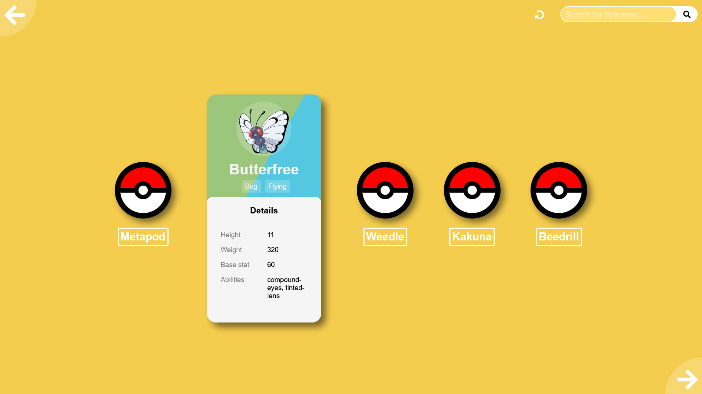

# Pokemon-cards
## Table of contents

- [Overview](#overview)
- [Screenshot](#screenshot)
- [Links](#links)
- [Built with](#built-with)
- [Author](#author)

## Overview

A site that first presents five pokeballs with name descriptors underneath. Upon clicking, the pokeball transforms into a pokemon card with some stats and a picture. There are next and previous buttons for producing another set of pokeballs and a search bar if you're looking for a specific pokemon. All of the information is fetched by the PokeAPI.

### Screenshot

### Links

- Live Site URL: https://my-pokecards.netlify.app/

### Built with

- Semantic HTML5 markup
- CSS custom properties
- Flexbox
- Javascript
- PokeAPI

## Author
- Website - Ronald Terblanche (https://ronaldterblanche.netlify.app/)
